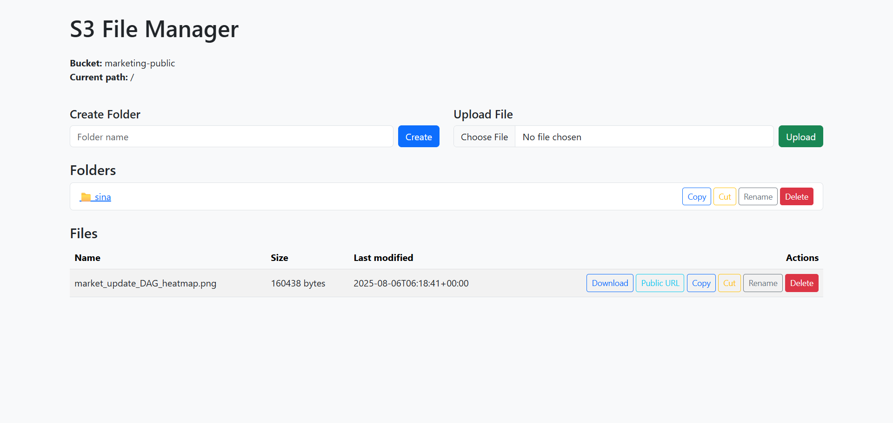

# An AWS S3 File Manager

This repository contains a simple PHP web application for managing files and folders
in an Amazon S3 bucket or any S3‑compatible object storage (such as MinIO,
DigitalOcean Spaces, Wasabi, etc.). The application uses the
[AWS SDK for PHP](https://docs.aws.amazon.com/sdk-for-php/) to perform operations
like listing objects, uploading files, creating folders, deleting objects,
renaming files, and generating presigned URLs for downloads.

## Features

* **List files and folders:** Browse the contents of a bucket using the S3
  `listObjectsV2` API with a delimiter to separate folders and files【29693054033651†L184-L209】.
* **Upload files:** Upload new files into the current folder.
* **Create folders:** Create empty “folders” (actually zero‑length objects
  ending with a trailing slash) inside the bucket.
* **Delete:** Remove files or folders from the bucket.
* **Rename files:** Copy a file to a new key and delete the old one.
* **Download:** Generate a presigned URL valid for 15 minutes and redirect
  users to it for secure downloads.

## Setup

1. **Clone this repository** into your web server’s document root or any
   directory you can serve with PHP.

2. **Install dependencies** using Composer. From inside the `s3filemanager` directory run:

   ```bash
   composer install
   ```

   This will install the AWS SDK for PHP as specified in `composer.json`.

3. **Configure your connection** by editing `config.php`. At minimum you
   must supply:

   * Your AWS access key ID and secret access key, either directly in the
     configuration array or by setting the environment variables
     `AWS_ACCESS_KEY_ID` and `AWS_SECRET_ACCESS_KEY`.
   * The region where your bucket resides (`us‑east‑1`, `eu‑central‑1`, etc.).
   * The name of the bucket you wish to manage.
   * (Optional) A custom `endpoint` if you are connecting to an S3‑compatible
     service like MinIO. When a custom endpoint is provided, the script will
     use path‑style addressing. This behaviour follows the example shown in the
     FileGator documentation where a custom S3 client is created with
     credentials and an endpoint【389494877136420†L133-L161】.

4. **Serve the application**. You can use PHP’s built‑in web server for quick
   testing:

   ```bash
   php -S localhost:8000
   ```

   Then visit `http://localhost:8000/index.php` in your browser.

## Security considerations

* Make sure you do **not** commit real AWS credentials into version control.
* Restrict access to this application (e.g. behind authentication) if it’s
  going to be hosted publicly.
* Consider using IAM roles or user policies to limit what the credentials
  allow (read/write only for a specific bucket).

## Extending

This application is intentionally simple and meant as a starting point. Some
ideas for further improvement include:

* Implement recursive deletion and folder renaming (copying all objects with a
  given prefix before deleting them).
* Support multi‑file uploads and drag‑and‑drop.
* Add user authentication and role‑based access control.
* Show previews for images and other file types.

## Licensing

This project is released under the MIT license. See `LICENSE` for details.
